# Лабораторная работа 3. Реализация серверной части на django rest. Документирование API.

---

## **Описание endpoint-ов**

Информация о всех сотрудниках авиакомпании

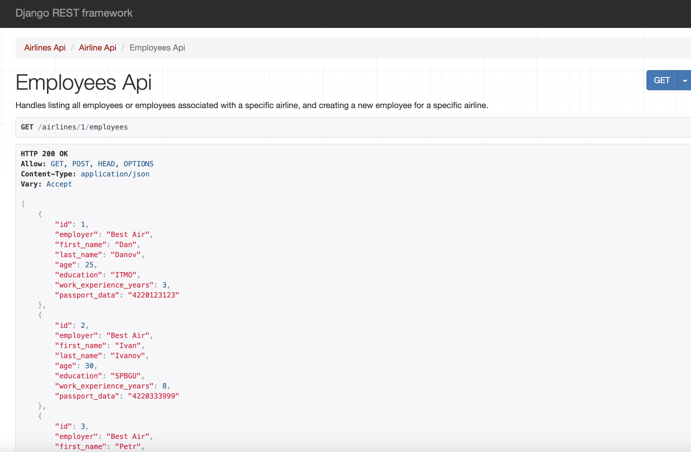

Информация о самолетах авиакомпании

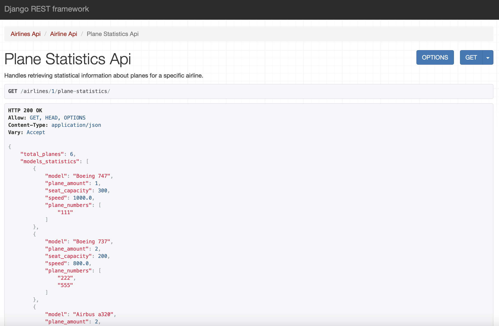

Информация о всех экипажах/Создание нового экипажа

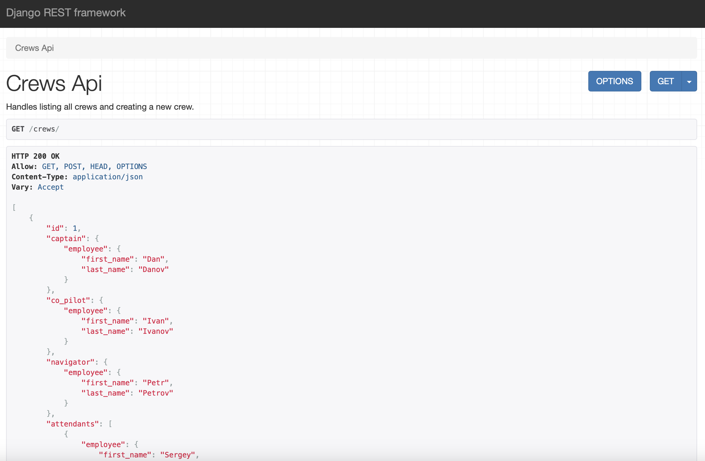
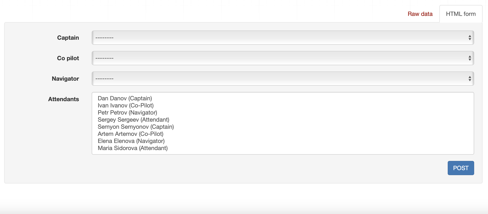

Список всех перелетов/Создание нового перелета

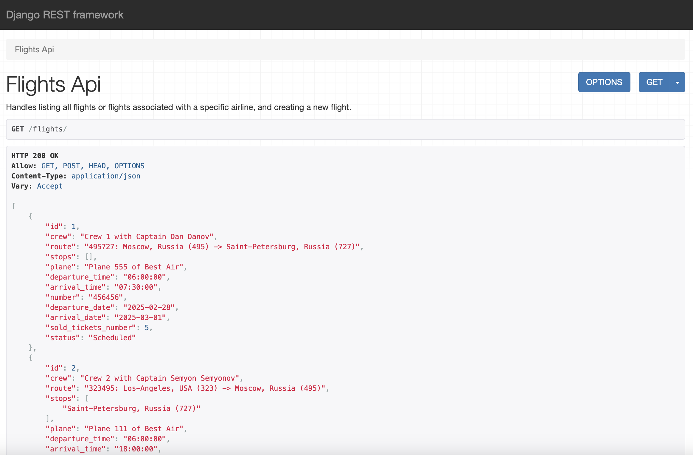
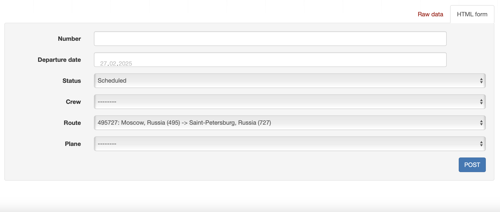

Самолеты, наиболее часто летающие по определенному маршруту

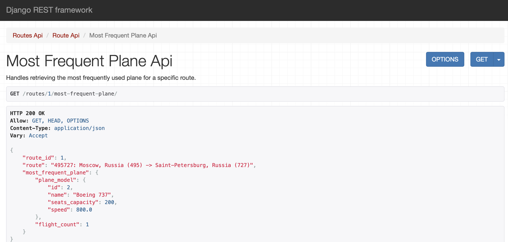

Все места на определенный рейс

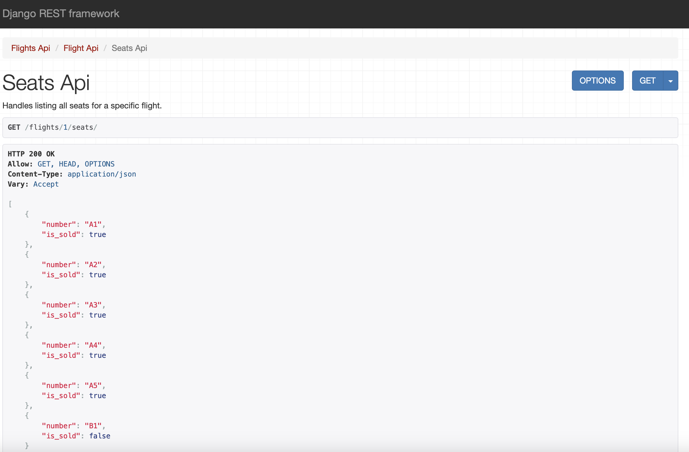

Все свободные места на определенный рейс

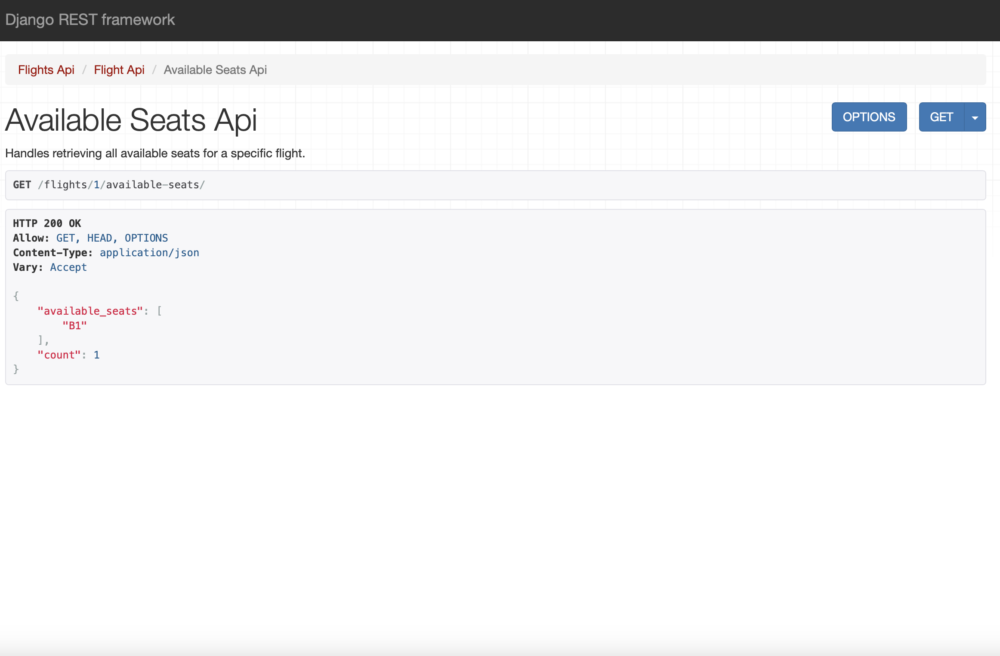

Забронировать место на определенный рейс

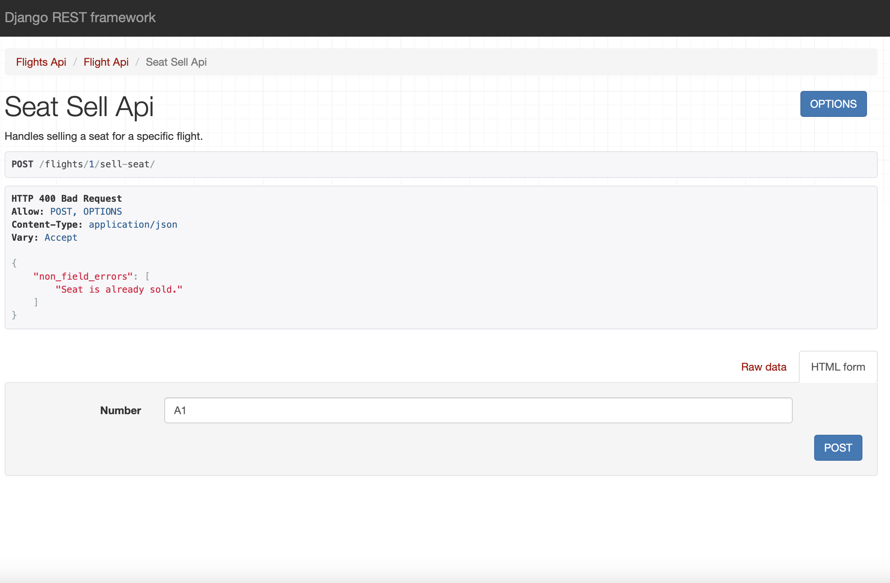

Посмотреть транзитные остановки/Добавить новую остановку

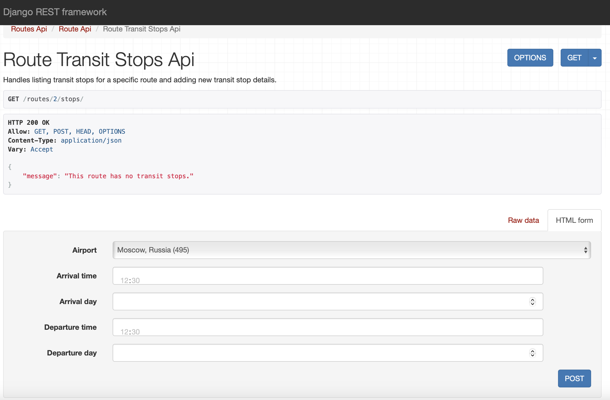

## **Djoser**

Регистрация

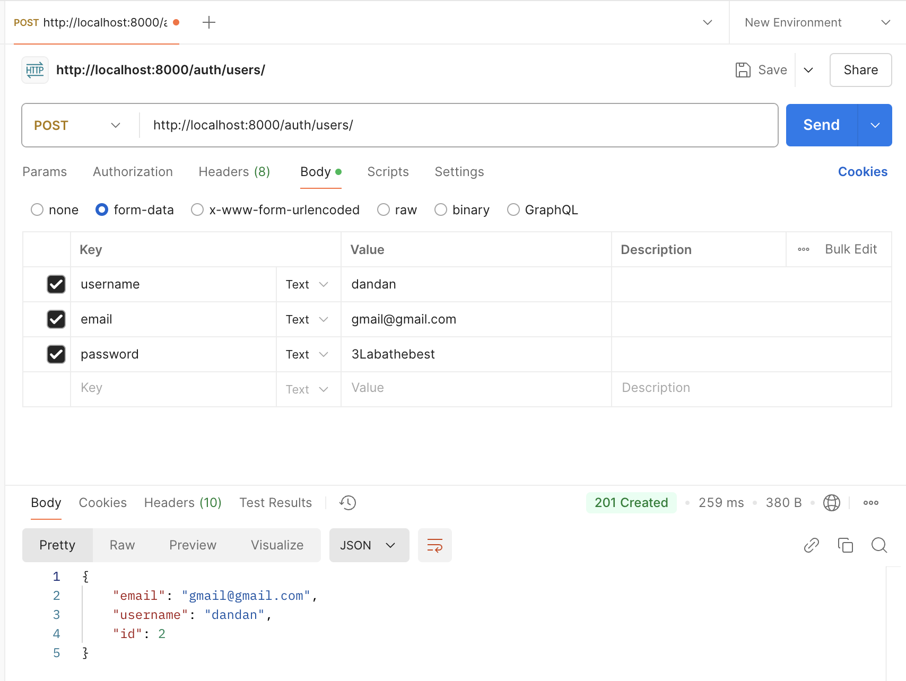

Получение токена

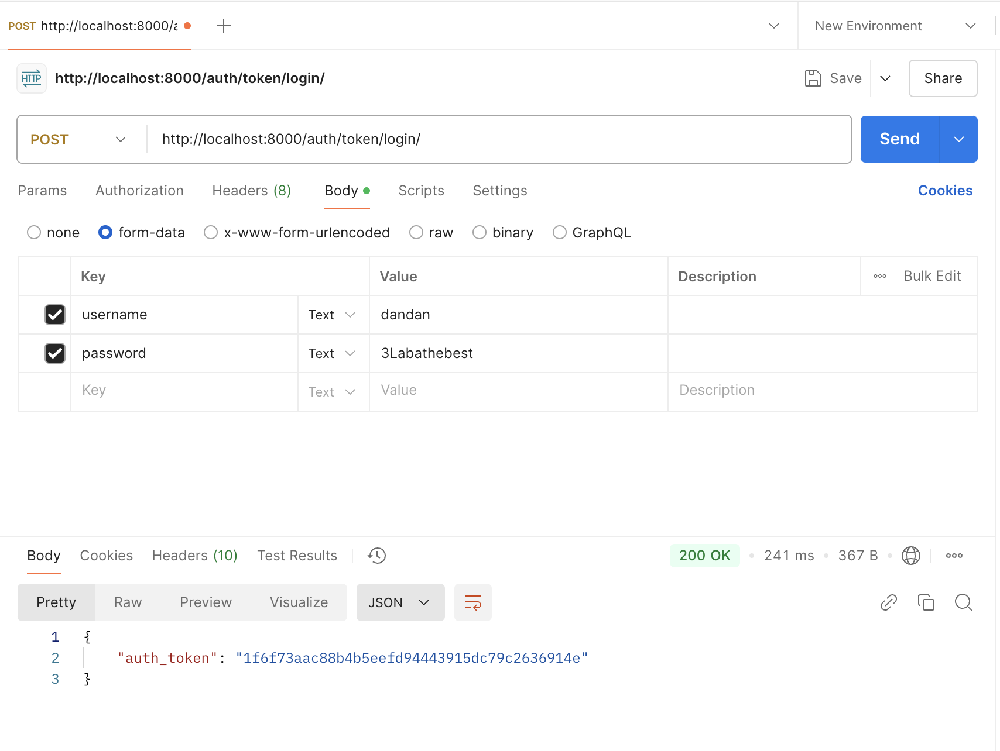

Текущий пользователь

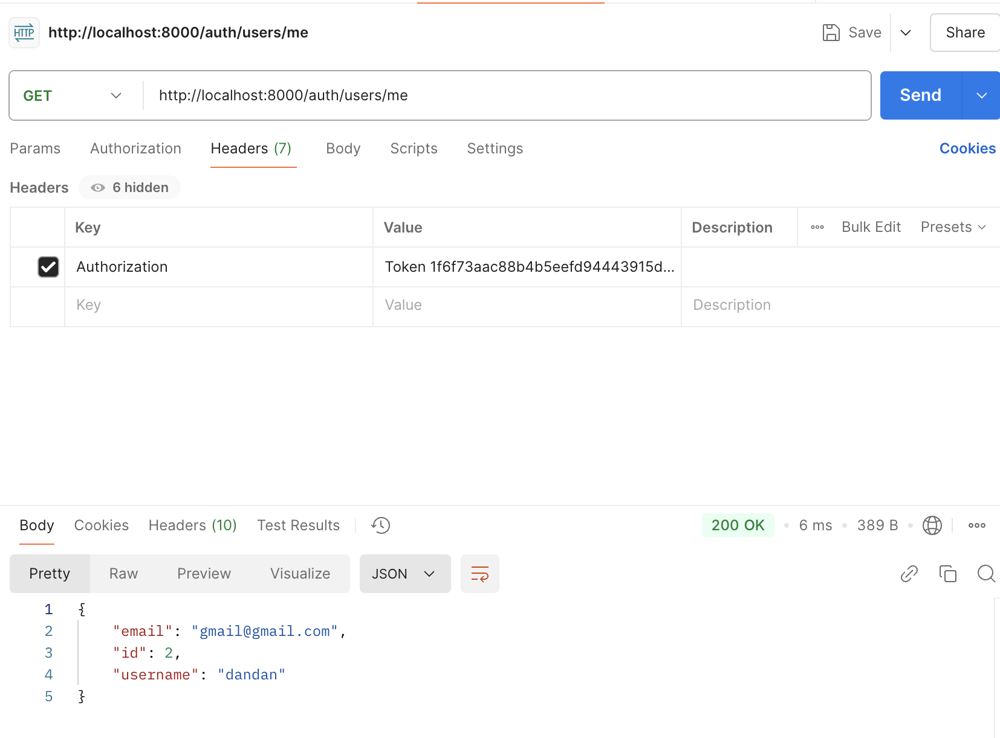

Создание сотрудника без авторизации/После авторизации

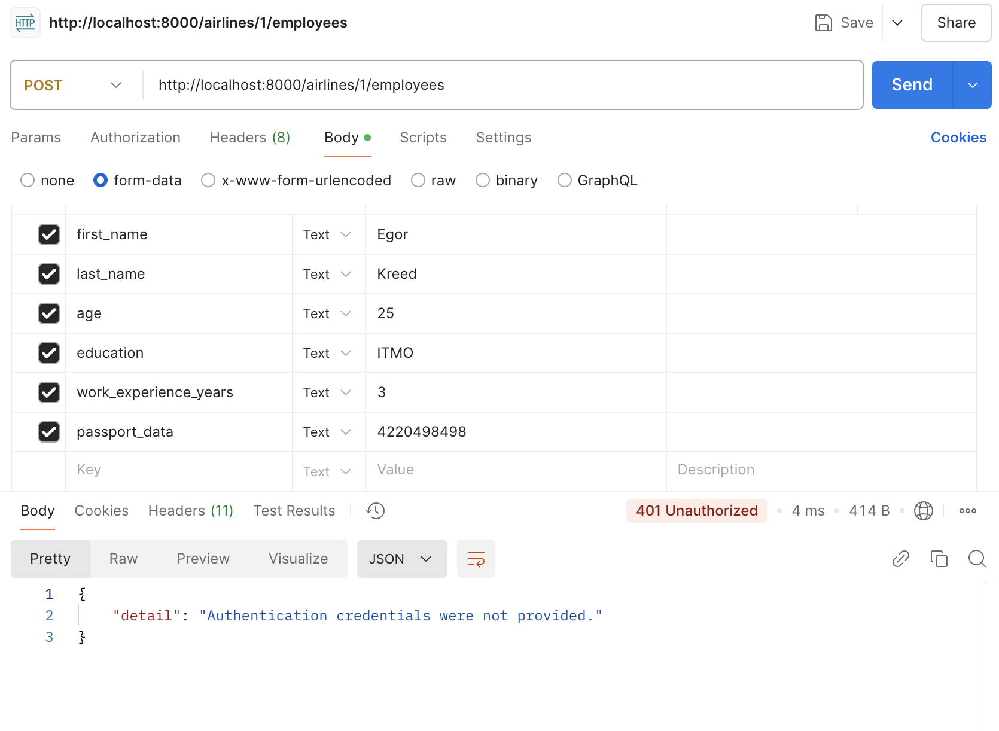

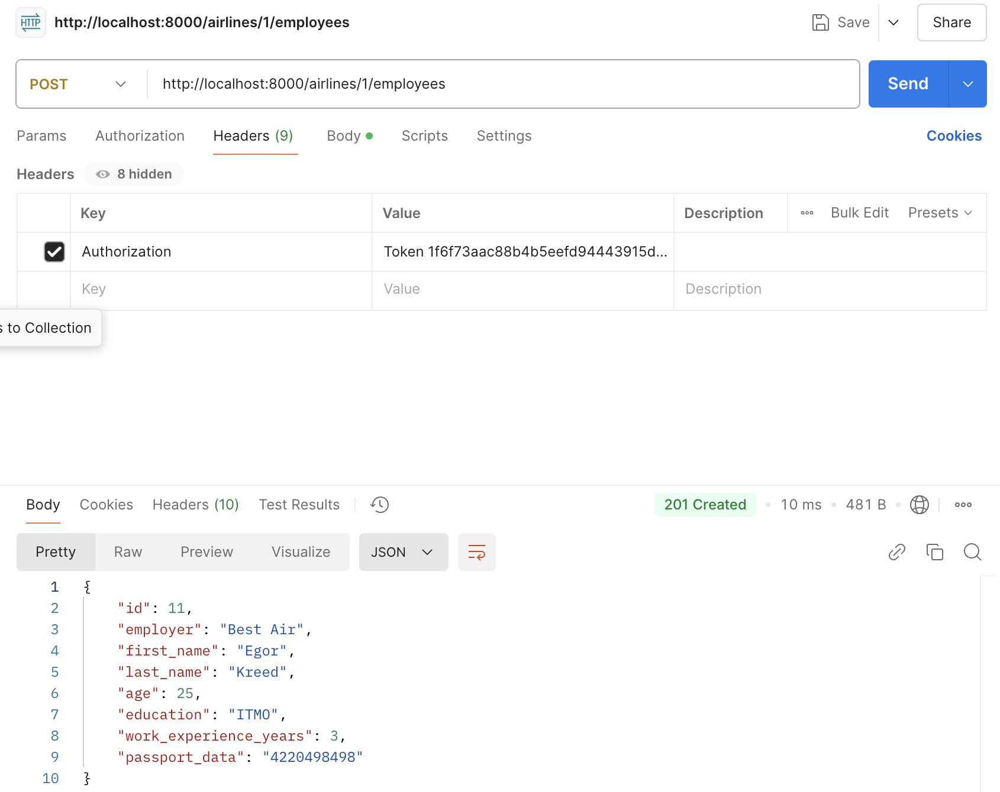
